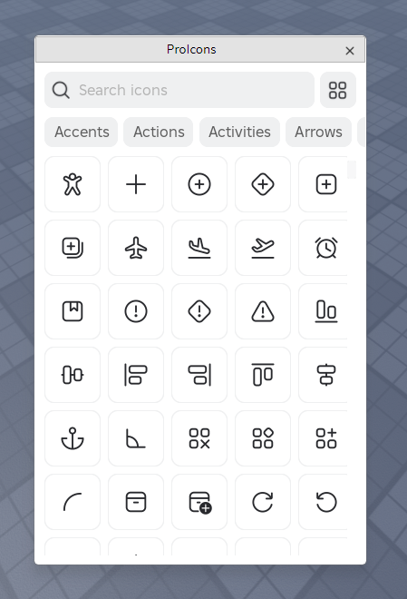

# ProIcons Roblox
The official Roblox Studio plugin for the [ProIcons icon library](https://github.com/ProCode-Software/proicons).



> [!IMPORTANT]  
> Due to Roblox [API changes](https://devforum.roblox.com/t/creator-action-required-new-asset-delivery-api-endpoints-for-community-tools/3574403), **new ProIcons Roblox uploads have been paused**. It is no longer possible to get the image ID of an asset when uploaded outside of Roblox Studio. Uploads will resume once Roblox makes this possible again.
>
> There are still 400+ icons available for use on Roblox, but new and updated icons aren't being uploaded.

## Features
- 📐 Modern UI based on [Next-Gen Studio UI](https://devforum.roblox.com/t/next-gen-studio-ui-preview-is-here-beta/3075390)
- 🖼️ High-quality, 128px icons

Uses the [ProIcons Roblox API](https://procode-software.github.io/proicons/docs/roblox-usage) to fetch icon image IDs, ~~so you will always have access to the latest icons when they become available~~.

## Installation
See [below](#building-from-source).

## Building from Source
### Installing the framework
The UI is created with [Forge](https://github.com/ProCode-Software/Forge). The package has not been published yet, so it must be manually installed.

1. Download Forge and create a symlink to it

2. Add this file at `src/Packages/Forge.luau`:
```luau
-- Change the path to the folder Forge/src/Forge/init.luau is in
local module = require('./_Index/Forge/')

return module
```
### Installing the plugin
Make sure you have [Rojo](https://rojo.space) installed. Then run the following command to install the plugin into Roblox Studio's plugin folder:
```bash
rojo build -p ProIcons.rbxm
```
For development, add the `--watch` flag. In Roblox Studio, make sure plugin debugging is enabled in settings, then right-click on *PluginDebugService > user_ProIcons.rbxm* and select *Reload Plugin*. You can also enable *Reload plugins on file changed* to do this automatically.

## License
The code for the plugin and the icons are licensed under the [MIT License](./LICENSE).
